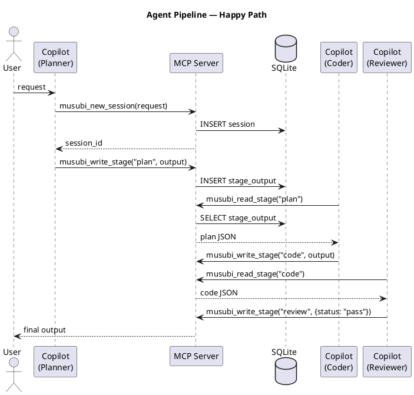
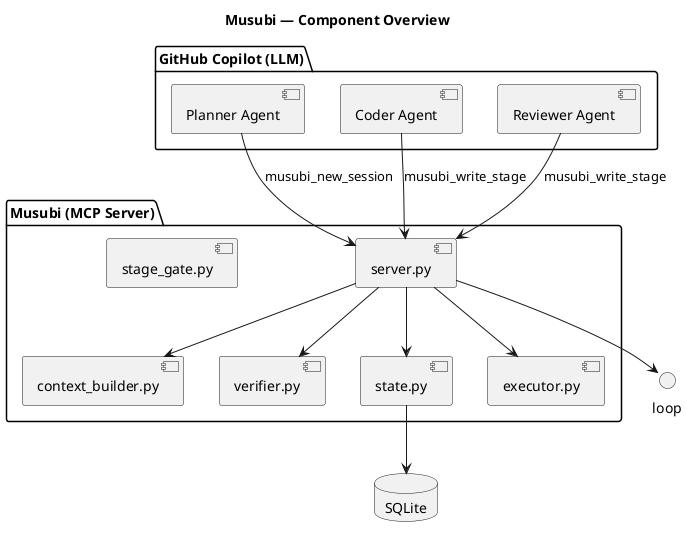
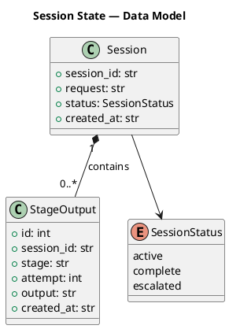
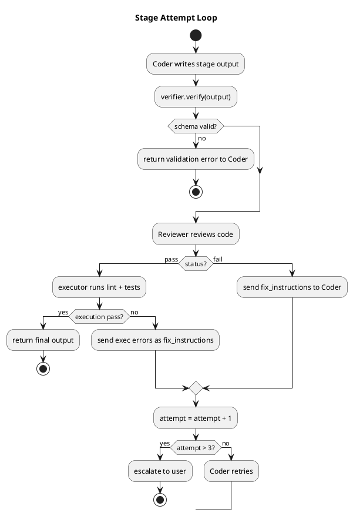
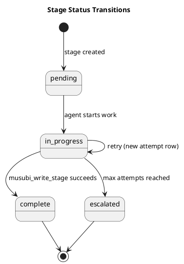

# PlantUML Guide — Documentation Skill Reference

Use this reference when writing PlantUML source or choosing which diagram type
fits a given relationship.

---

## Choosing a Diagram Type

| Type | Use when | Keyword |
|------|---------|---------|
| Sequence | A → B → C call flow, API interactions, agent pipeline | `@startuml` + `participant` |
| Component | System architecture, module dependencies | `@startuml` + `component` |
| Class | Data models, schemas, inheritance | `@startuml` + `class` |
| Activity | Flowcharts, decision trees, correction loop | `@startuml` + `start` |
| State | State machines (session status transitions) | `@startuml` + `[*]` |

---

## Sequence Diagram



### Syntax reference

```plantuml
A -> B : label          " synchronous call
A --> B : label         " dashed return
A ->> B : label         " async call
activate A              " show activation bar
deactivate A
group optional [condition]
    A -> B
end
alt success
    A -> B
else failure
    A -> C
end
```

---

## Component Diagram



---

## Class Diagram



---

## Activity Diagram (Stage Attempt Loop)



---

## State Diagram (Session Stage Status)



---

## Styling Tips

```plantuml
@startuml
skinparam backgroundColor #FEFEFE
skinparam participant {
    BackgroundColor #DAE8FC
    BorderColor #6C8EBF
}
skinparam sequence {
    ArrowColor #333333
    LifeLineBorderColor #666666
}
@enduml
```

- Use `skinparam` blocks at the top for consistent styling.
- Keep diagrams under 20 participants/components — split into sub-diagrams if larger.
- Use `note left/right of X` for annotations.
- Use `== Phase Name ==` separators in sequence diagrams to mark stages.
