# CopilotHarness — Class Diagram

> Companion to [`design.md`](./design.md) (architecture + schemas) and
> [`usecase-diagram.md`](./usecase-diagram.md) (user-facing surfaces).
> Captures TypeScript classes / interfaces + Python dataclasses, each
> tagged `harness-tier: substrate` or `harness-tier: ephemeral` per
> Hard Invariant #9.
>
> Updates: bump alongside any code change that adds, removes, or
> renames a meaningful class. The class index table at the bottom is
> the navigation aid — keep it in sync.

This is the "what types exist" view. For "how the model gets
governed across stages", read [`design.md`](./design.md). For "what
the developer can do", read [`usecase-diagram.md`](./usecase-diagram.md).

---

## Reading the harness-tier annotations

Per HI #9 ([`harness-direction.md`](./harness-direction.md) § 2), every
component is either **substrate** (invest, refactor, build on; survives
model releases) or **ephemeral** (compensates for current model weakness;
expected to dissolve on a future release). Each class below carries the
tag.

In the Mermaid diagrams, the tag appears as a `note for X "substrate"`
(or `"ephemeral"`) block under the class.

---

## Diagram A — TypeScript classes

The TS layer is split between substrate primitives (budget enforcement,
MCP client, telemetry shapes) and ephemeral runtime fixtures
(TreeDataProvider sidebar surfaces, per-stage spawn budget, agent-side
spawn tracker / dedup).

```mermaid
classDiagram
    direction TB

    %% ── substrate ─────────────────────────────────────────────────
    class ModelRate {
        <<interface>>
        +number input
        +number cached_input
        +number output
        +number cache_write
    }
    note for ModelRate "harness-tier: substrate · pipelineBudgetCore.ts"

    class PipelineBudgetConfig {
        <<interface>>
        +number maxCredits
        +number warnAtRatio
    }
    note for PipelineBudgetConfig "harness-tier: substrate · pipelineBudgetCore.ts"

    class BudgetEnforcer {
        +readonly maxCredits: number
        +readonly warnAtRatio: number
        -_creditsUsed: number
        -_warned: boolean
        +get creditsUsed() number
        +get remaining() number
        +get warned() boolean
        +preflight(estimatedCredits) BudgetStatus
        +charge(actualCredits) BudgetStatus
    }
    note for BudgetEnforcer "harness-tier: substrate · pipelineBudgetCore.ts<br/>Universal cost guardrail — survives pipeline collapse"

    class BudgetEvent {
        <<interface>>
        +status: 'info'|'warn'|'halt'
        +phase: 'preflight'|'postflight'
        +creditsUsed: number
        +maxCredits: number
        +remaining: number
        +family: string
        +thisCallCredits: number
    }
    note for BudgetEvent "harness-tier: substrate · pipelineBudgetCore.ts"

    class ActiveBudget {
        <<interface>>
        +enforcer: BudgetEnforcer
        +onEvent: (BudgetEvent) =&gt; void
    }
    note for ActiveBudget "harness-tier: substrate · pipelineBudgetCore.ts"

    class ActiveBudgetSnapshot {
        <<interface>>
        +creditsUsed: number
        +maxCredits: number
        +remaining: number
        +warnAtRatio: number
    }
    note for ActiveBudgetSnapshot "harness-tier: substrate · pipelineBudgetCore.ts<br/>Stage 1 MVP A.4 — flat read-shape for sidebar/status"

    class BudgetExhaustedError {
        +readonly phase: 'preflight'|'postflight'
        +readonly creditsUsed: number
        +readonly maxCredits: number
        +readonly family: string
        +readonly thisCallCredits: number
    }
    note for BudgetExhaustedError "harness-tier: substrate · pipelineBudgetCore.ts<br/>Extends Error"

    class McpClient {
        +static create(bin, args, env, opts) Promise~McpClient~
        +listTools() Promise~McpToolDef[]~
        +callTool(name, args) Promise~string~
        +dispose() void
    }
    note for McpClient "harness-tier: substrate · mcpClient.ts<br/>The interface between TS shell and Python harness"

    class McpToolDef {
        <<interface>>
        +name: string
        +description?: string
        +inputSchema: object
    }
    note for McpToolDef "harness-tier: substrate · mcpClient.ts"

    %% Sidebar aggregation shapes (Stage 1 MVP A.4)
    class StageMetricsRow {
        <<interface>>
        +stage: string
        +chunk_id: string|null
        +attempt: number
        +started_at: number
        +lm_ms: number
        +tokens_in_estimate: number
        +tokens_out_estimate: number
        +credits?: number
        +model_family?: string|null
    }
    note for StageMetricsRow "harness-tier: substrate · tasksViewCore.ts<br/>Mirrors SQL row shape"

    class StageSummary {
        <<interface>>
        +stage: string
        +status: string
        +attempt: number
        +totalLmMs: number
        +totalCredits: number
        +rowCount: number
        +chunks: ChunkSummary[]
    }
    note for StageSummary "harness-tier: substrate · tasksViewCore.ts<br/>Pure aggregation result"

    class ChunkSummary {
        <<interface>>
        +chunk_id: string
        +attempt: number
        +totalLmMs: number
        +totalCredits: number
        +rowCount: number
    }
    note for ChunkSummary "harness-tier: substrate · tasksViewCore.ts"

    class BudgetSnapshot {
        <<interface>>
        +creditsUsed: number
        +maxCredits: number
        +remaining: number
        +warnAtRatio: number
    }
    note for BudgetSnapshot "harness-tier: substrate · tasksViewCore.ts<br/>Stage 1 MVP A.4"

    class SessionSummary {
        <<interface>>
        +sessionId: string
        +status: string
        +totalCredits: number
        +liveBudget: BudgetSnapshot|null
    }
    note for SessionSummary "harness-tier: substrate · tasksViewCore.ts<br/>Stage 1 MVP A.4"

    %% ── ephemeral ─────────────────────────────────────────────────
    class TreeDataProvider~T~ {
        <<interface>>
        +onDidChangeTreeData: Event
        +getTreeItem(T) TreeItem
        +getChildren(T?) Promise~T[]~
    }
    note for TreeDataProvider "harness-tier: substrate (VS Code API)<br/>shown for context"

    class HarnessTasksProvider {
        +refresh(node?) void
        +getTreeItem(node) TreeItem
        +getChildren(node?) Promise~TaskNode[]~
        -loadActiveStages() Promise~TaskNode[]~
        -loadHistory() Promise~TaskNode[]~
    }
    note for HarnessTasksProvider "harness-tier: ephemeral · tasksView.ts<br/>expires-when: pipeline collapses to one stage<br/>cost-lever: ~0 (UX, not cost)"

    class HarnessModelsProvider {
        +refresh() void
        +getTreeItem(node) TreeItem
        +getChildren(node?) Promise~ModelNode[]~
    }
    note for HarnessModelsProvider "harness-tier: ephemeral · modelsView.ts<br/>expires-when: single-model assumption stable"

    class HarnessPipelinesProvider {
        +refresh() void
        +getTreeItem(node) TreeItem
        +getChildren(node?) Promise~PipelineNode[]~
    }
    note for HarnessPipelinesProvider "harness-tier: ephemeral · pipelinesView.ts<br/>expires-when: pipeline shape dissolves (Track D.10)"

    class StageSpawnBudget {
        +readonly sessionId: string
        +readonly stageKey: string
        +readonly limit: number
        +get used() number
        +get remaining() number
        +get exhausted() boolean
        +consume() void
        +reset() void
    }
    note for StageSpawnBudget "harness-tier: ephemeral · runners/pipelineSubagentBudget.ts<br/>expires-when: pre-spawn fanout dissolves (Track D)"

    class SubagentBudgetExhausted {
        +readonly budget: StageSpawnBudget
    }
    note for SubagentBudgetExhausted "harness-tier: ephemeral · runners/pipelineSubagentBudget.ts<br/>Extends Error · companion to StageSpawnBudget"

    class SpawnTracker {
        +recordSpawn(toolName, handleId, role?) void
        +recordAwait(handleId) void
        +outstanding() string[]
    }
    note for SpawnTracker "harness-tier: ephemeral · runners/agentCore.ts<br/>expires-when: agent-side spawn dissolves"

    class TriggerDedup {
        +shouldFire(label) boolean
        +reset() void
    }
    note for TriggerDedup "harness-tier: ephemeral · runners/agentCore.ts<br/>expires-when: distillation triggers re-shape"

    %% ── relationships ────────────────────────────────────────────
    BudgetEnforcer --> BudgetExhaustedError : throws
    BudgetEnforcer ..> ModelRate : reads via RATES lookup
    BudgetEnforcer --> BudgetEvent : emits via onEvent
    BudgetEnforcer ..> ActiveBudgetSnapshot : produces via snapshotActiveBudget
    ActiveBudget *-- BudgetEnforcer : holds
    PipelineBudgetConfig ..> BudgetEnforcer : constructs

    McpClient ..> McpToolDef : returns from listTools

    StageSummary *-- ChunkSummary : aggregates
    StageSummary ..> StageMetricsRow : aggregates rows
    SessionSummary *-- BudgetSnapshot : holds optional

    HarnessTasksProvider --|> TreeDataProvider : implements
    HarnessModelsProvider --|> TreeDataProvider : implements
    HarnessPipelinesProvider --|> TreeDataProvider : implements
    HarnessTasksProvider ..> McpClient : uses
    HarnessTasksProvider ..> SessionSummary : renders
    HarnessTasksProvider ..> StageSummary : renders

    StageSpawnBudget --> SubagentBudgetExhausted : throws
```

---

## Diagram B — Python dataclasses

The Python layer is **function-heavy, not class-heavy** by design — the
`server.py` MCP layer is a dispatcher with zero state machines, and
most operations are pure data transformations on rows. The classes
that DO exist are storage / validation / execution shapes, all
substrate.

```mermaid
classDiagram
    direction TB

    %% ── validation ────────────────────────────────────────────────
    class ValidationResult {
        +bool valid
        +list~str~ errors
        +ok()$ ValidationResult
        +failed(errors)$ ValidationResult
    }
    note for ValidationResult "harness-tier: substrate · validation/verifier.py<br/>HI #5 fail-closed schema gate result"

    class SubagentVerifyResult {
        +bool valid
        +list~str~ errors
        +str~|None~ truncated_summary
    }
    note for SubagentVerifyResult "harness-tier: substrate · validation/verifier.py<br/>Sub-agent summary cap + injection check"

    %% ── execution (deterministic, NOT LLM) ─────────────────────────
    class LintError {
        +str file
        +int line
        +int col
        +str code
        +str message
    }
    note for LintError "harness-tier: substrate · execution/executor.py"

    class LintResult {
        +bool passed
        +list~LintError~ errors
        +str raw
    }
    note for LintResult "harness-tier: substrate · execution/executor.py<br/>ruff pass / fail"

    class TypeCheckError {
        +str file
        +int line
        +str message
    }
    note for TypeCheckError "harness-tier: substrate · execution/executor.py"

    class TypeCheckResult {
        +bool passed
        +list~TypeCheckError~ errors
        +str raw
    }
    note for TypeCheckResult "harness-tier: substrate · execution/executor.py<br/>mypy pass / fail"

    class FailedTest {
        +str test_name
        +str reason
    }
    note for FailedTest "harness-tier: substrate · execution/executor.py"

    class RunResult {
        +bool passed
        +list~FailedTest~ failures
        +str raw
    }
    note for RunResult "harness-tier: substrate · execution/executor.py<br/>pytest pass / fail"

    class ExecutionResult {
        +bool passed
        +LintResult~|None~ lint
        +TypeCheckResult~|None~ typecheck
        +RunResult~|None~ tests
    }
    note for ExecutionResult "harness-tier: substrate · execution/executor.py<br/>The full verification pass result"

    %% ── session ───────────────────────────────────────────────────
    class LoopResult {
        +str action
        +int attempt
        +list~str~ fix_instructions
        +dict~|None~ escalation
        +list~str~ triggered_patches
    }
    note for LoopResult "harness-tier: ephemeral · session/correction_loop.py<br/>expires-when: correction loop dissolves (Track D.5 generalises)<br/>cost-lever: ~1x stage cost per retry avoided"

    class Chunk {
        +str chunk_id
        +str task_label
        +tuple~str~ file_paths
    }
    note for Chunk "harness-tier: ephemeral · session/chunks.py · frozen<br/>expires-when: pipeline chunking dissolves"

    %% ── skills ────────────────────────────────────────────────────
    class SkillMeta {
        +str skill_id
        +str title
        +str path
    }
    note for SkillMeta "harness-tier: substrate · skills/skill_loader.py<br/>Catalog entry — fat-skills direction"

    %% ── relationships ────────────────────────────────────────────
    LintResult *-- LintError : aggregates
    TypeCheckResult *-- TypeCheckError : aggregates
    RunResult *-- FailedTest : aggregates
    ExecutionResult o-- LintResult : optional
    ExecutionResult o-- TypeCheckResult : optional
    ExecutionResult o-- RunResult : optional
```

---

## Class index

Navigation aid. `harness-tier` matches the notes in the diagrams; each
row's file path resolves to a real file.

### TypeScript

| Class / Interface | File | tier | Purpose |
|---|---|---|---|
| `BudgetEnforcer` | `pipelineBudgetCore.ts` | substrate | Per-session credit accounting with soft-warn + hard-stop |
| `BudgetExhaustedError` | `pipelineBudgetCore.ts` | substrate | Thrown when projected total exceeds cap |
| `ModelRate` | `pipelineBudgetCore.ts` | substrate | Per-million-token rate tuple |
| `PipelineBudgetConfig` | `pipelineBudgetCore.ts` | substrate | Parsed `max_credits` + `warn_at` from `pipeline.yaml` |
| `BudgetEvent` | `pipelineBudgetCore.ts` | substrate | Chat-side credit-line payload |
| `ActiveBudget` | `pipelineBudgetCore.ts` | substrate | Registry entry: `{enforcer, onEvent}` |
| `ActiveBudgetSnapshot` | `pipelineBudgetCore.ts` | substrate | Flat read-shape (Stage 1 MVP A.4) |
| `McpClient` | `mcpClient.ts` | substrate | Stdio MCP client; the only path to the Python harness |
| `McpToolDef` | `mcpClient.ts` | substrate | One tool definition returned by `listTools` |
| `StageMetricsRow` | `tasksViewCore.ts` | substrate | TS view of one `stage_metrics` SQL row |
| `StageSummary` | `tasksViewCore.ts` | substrate | Aggregated per-stage metrics for sidebar render |
| `ChunkSummary` | `tasksViewCore.ts` | substrate | Aggregated per-chunk metrics |
| `BudgetSnapshot` | `tasksViewCore.ts` | substrate | Stage 1 MVP A.4 — sidebar's read shape |
| `SessionSummary` | `tasksViewCore.ts` | substrate | Stage 1 MVP A.4 — picks live-vs-historic |
| `HarnessTasksProvider` | `tasksView.ts` | ephemeral | VS Code TreeDataProvider for the Tasks sidebar |
| `HarnessModelsProvider` | `modelsView.ts` | ephemeral | TreeDataProvider for the Models sidebar |
| `HarnessPipelinesProvider` | `pipelinesView.ts` | ephemeral | TreeDataProvider for the Pipelines sidebar |
| `StageSpawnBudget` | `runners/pipelineSubagentBudget.ts` | ephemeral | Per-stage-attempt sub-agent spawn counter |
| `SubagentBudgetExhausted` | `runners/pipelineSubagentBudget.ts` | ephemeral | Error: spawn cap hit |
| `SpawnTracker` | `runners/agentCore.ts` | ephemeral | Agent-turn sub-agent spawn registry |
| `TriggerDedup` | `runners/agentCore.ts` | ephemeral | Per-turn duplicate-trigger guard |

### Python

| Class | File | tier | Purpose |
|---|---|---|---|
| `ValidationResult` | `validation/verifier.py` | substrate | HI #5 fail-closed schema + injection check result |
| `SubagentVerifyResult` | `validation/verifier.py` | substrate | Sub-agent summary cap + injection scan result |
| `LintError` / `LintResult` | `execution/executor.py` | substrate | ruff finding + pass-fail aggregate |
| `TypeCheckError` / `TypeCheckResult` | `execution/executor.py` | substrate | mypy finding + pass-fail aggregate |
| `FailedTest` / `RunResult` | `execution/executor.py` | substrate | pytest failure + pass-fail aggregate |
| `ExecutionResult` | `execution/executor.py` | substrate | Combined lint / typecheck / test verification result |
| `LoopResult` | `session/correction_loop.py` | ephemeral | Correction-loop decision (action, attempt, fix_instructions) |
| `Chunk` | `session/chunks.py` | ephemeral | Per-task design slice (frozen) |
| `SkillMeta` | `skills/skill_loader.py` | substrate | Skill catalog entry |

---

## What's NOT a class

By article-aligned design, several systems are **functions over plain
dicts**, not class hierarchies:

- **MCP tools** (`server.py`) — `@mcp.tool`-decorated functions, no
  state machine
- **DB CRUD** (`storage/db.py`) — module-level functions over
  `sqlite3.Connection`, no ORM
- **Routing** (`extension.ts`) — `parseCommand` returns a discriminated
  union; the dispatcher is a `switch`, not a router class
- **The 4-stage pipeline** (`pipeline.ts`) — `runPipeline`,
  `runChunkedCodeAndReview`, `runAgentLM` are functions, not classes.
  This is deliberate — the pipeline shape is ephemeral
  (Track D dissolves it), and wrapping ephemeral structure in a class
  hierarchy makes it harder to delete

The class diagram captures only what genuinely benefits from class
shape — primarily the budget enforcement chain, the MCP client, the
sidebar TreeDataProviders, and the verification dataclasses.

---

## When to update this doc

- Adding / removing / renaming an exported class or interface used by
  more than one module: add a row + Mermaid block
- Promoting an ephemeral component to substrate (or vice versa): bump
  the note tag in both the Mermaid and the index
- Quarterly delete-pass ([`harness-direction.md`](./harness-direction.md)
  Track C.3): cross-check the diagram against current code; remove
  dissolved classes
