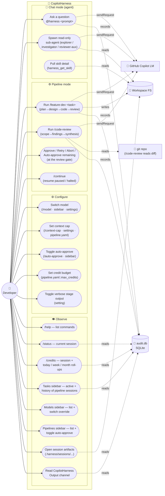

# CopilotHarness — Use Case Diagram

> Status: drafted from real surfaces present in `dev`. Last updated
> after PR #68 (per-cycle `agent_cycles` audit).
> Updates: bump alongside any change that adds, removes, or renames a
> user-facing capability.

This document captures **what CopilotHarness lets a developer do**.
Architecture, schemas, and internal flow live in
[`design.md`](./design.md); class shapes live in
[`class-diagram.md`](./class-diagram.md); roadmap and phase status
live in [`roadmap.md`](./roadmap.md). This is the user-facing surface
only.

---

## Primary actor

**Developer** — the human using VS Code with the CopilotHarness
extension installed.

## External systems CopilotHarness talks to

| System | Direction | What |
|---|---|---|
| **GitHub Copilot LM** | OUT | Every LM call goes through `vscode.lm.sendRequest`. Models: Claude (Sonnet / Haiku / Opus), GPT-4o / 4.1 / 5-mini, Gemini Flash. |
| **Workspace filesystem** | OUT (read) + OUT (write) | Read by agent + sub-agents + reviewer; written by coder during `/feature-dev`. |
| **Harness SQLite (`audit.db`)** | OUT | Sessions, stage outputs, conversation messages, sub-agent audit, stage metrics, **agent_cycles** (per-`sendRequest` cycle audit), agent turns, schema migrations. |
| **`.github/` in workspace** | OUT (read) | Agents (`.github/agents/`), skills (`.github/skills/`), pipelines (`.github/pipelines/`), memory (`.github/memory/`). |

## Use case diagram

---

## Use cases by group

### 💬 Chat mode (agent)

| Use case | Trigger | Output |
|---|---|---|
| **Ask a question** | `@harness <prompt>` in chat panel | Direct LM reply; may spawn sub-agents inline; conversation persists across VS Code restarts via `conversation_messages` table |
| **Spawn read-only sub-agent** | Done by LM, not user — agent decides per turn | Sub-agent runs in isolated context with one-sentence brief; result spliced back into agent turn; audit row written |
| **Pull skill detail on demand** | Done by LM via `harness_get_skill` tool | Skill body returned only when the model decides it needs the detail — agent's "pull" model (Hard Invariant #2 relaxation) |

### ⚙️ Pipeline mode

| Use case | Trigger | Output |
|---|---|---|
| **Run `/feature-dev <task>`** | `/feature-dev <one-line goal>` | Multi-stage run: planner → designer → coder → reviewer with correction loop. Per-chunk if scope.files > threshold. Stage outputs land in `.harness/sessions/<sid>/<stage>.md`. |
| **Run `/code-review`** | `/code-review [base..head]` | 3-stage run: scoper (parse diff) → finder (per-file analysis) → synthesizer (aggregate). Reviewer-aux fans out per file. |
| **Review gate decision** | Buttons appear after every non-reviewer stage | Four choices: ✓ Approve · ↻ Retry (with hint) · ✕ Abort · ⚡ Run remaining without review. Persisted via `harness_pause_session` / `harness_resume_session`. |
| **Continue paused / halted session** | `/continue` after a gate-pause OR a budget halt | Picks up where the previous run left off; same session_id; new attempts appended (`<stage>.attemptN.md`). |

### ⚙️ Configure

| Use case | Surfaces | Setting written |
|---|---|---|
| **Switch model** | `/model [family\|clear]` in chat · Models sidebar (click) · VS Code settings | `copilotHarness.modelOverride` (global) |
| **Set context cap** | `/context-cap [N\|clear]` · settings · `pipeline.yaml::context_cap:` | `copilotHarness.contextCap` (global) OR per-pipeline yaml |
| **Toggle auto-approve** | `/auto-approve [pipeline] [on\|off\|clear]` · Pipelines sidebar (click) · settings | `copilotHarness.autoApprove.<pipeline>` (global) |
| **Set credit budget** | Edit `pipeline.yaml::max_credits:` / `warn_at:` directly | per-pipeline yaml |
| **Toggle verbose stage output** | VS Code settings | `copilotHarness.verboseStageOutput` (global) |

### 👁 Observe

| Use case | Where | Shows |
|---|---|---|
| **`/help`** | Chat panel | All slash commands grouped (Pipelines / Agents / Commands), sidebar views, cost controls, built-ins |
| **`/status`** | Chat panel | Active session id, stage-by-stage progress, attempts, **cumulative credit usage** (live snapshot or persisted total) |
| **`/credits`** | Chat panel | Active session credits (live or paused) + Today / This week / This month roll-ups summed from `stage_metrics.credits` across all sessions |
| **Tasks sidebar** | Activity bar → CopilotHarness icon | Active pipeline session (live), **session-level budget header** (live snapshot or persisted credits used), history (recent sessions, stages, outcomes), click stage row to open artifact |
| **Models sidebar** | Activity bar → CopilotHarness icon | All Copilot-surfaced families; active override marked; click to switch |
| **Pipelines sidebar** | Activity bar → CopilotHarness icon | All declared pipelines; current auto-approve state; click to toggle |
| **Session artifacts** | File browser on `.harness/sessions/<sid>/` | `plan.md`, `design.md`, `code.md`, `review.md` (+ `.attemptN.md` retries). The persistent record. |
| **Output channel** | VS Code Output panel → "CopilotHarness" | Per-LM-call timings, model selection, budget events, sub-agent spawns/completions, MCP server stderr |

---

## What you can NOT do (intentional non-features)

| | Why |
|---|---|
| Have the LM modify multiple files outside the plan scope mid-stage | Coder is pinned to `plan.scope.files`; future A2 may relax with path-scoped enforcement |
| Run two pipelines concurrently in the same workspace | Single active-session pointer; second invocation waits |
| Have sub-agents see the agent conversation | Hard Invariant #3 (evaluator firewall) — sub-agents see only their brief |
| Skip the schema validator on stage output | Hard Invariant #5 (fail-closed policy) — pipelines refuse to accept malformed output |
| Run an LM call from inside the harness Python server | Hard Invariant #1 — zero LLM calls in the harness; only `vscode.lm.sendRequest` reaches the model |

---

## Relationships between use cases (`<<includes>>` / `<<extends>>`)

- **`/feature-dev`** *includes* **review-gate decision** (fires between every non-reviewer stage)
- **`/code-review`** *includes* per-file fan-out (reviewer-aux per high-priority file)
- **`/continue`** *extends* every pipeline use case (resume after pause)
- **Switch model** *extends* every LM-call use case (governs which family is invoked)
- **Set context cap** *extends* every LM-call use case (governs how much history is replayed)
- **Set credit budget** *extends* every pipeline use case (halts if cumulative cost would exceed cap)

---

## Where each use case is implemented

| Use case | Primary file |
|---|---|
| Ask a question | `copilot-harness-extension/src/runners/agent.ts` |
| Spawn sub-agent | `runners/subagentRunner.ts` + `scripts/policy_engine.py` |
| `/feature-dev` | `pipeline.ts::runPipeline` |
| `/code-review` | `pipeline.ts::runCodeReviewBody` |
| Review gate | `pipelineGateUi.ts::runStageReviewGate` |
| `/continue` | `pipeline.ts::runStep` |
| `/model` | `extension.ts::runModel` + `modelSelector.ts` |
| `/context-cap` | `extension.ts::runContextCap` + `contextCap.ts` |
| `/auto-approve` | `extension.ts::runAutoApprove` + Pipelines sidebar (`pipelinesView.ts`) |
| Credit budget | `pipeline.ts` + `pipelineBudgetCore.ts` |
| Tasks sidebar | `tasksView.ts` |
| Models sidebar | `modelsView.ts` |
| Pipelines sidebar | `pipelinesView.ts` |
| `/help` | `extension.ts::buildHelpMarkdown` + `USAGE_FOOTER` |
| `/status` | `extension.ts::showStatus` |
| `/credits` | `extension.ts::runCredits` + `harness_credits_since` MCP tool + `harness_session_credits` MCP tool |
| Audit / metrics | `copilot-harness/storage/db.py` (`stage_metrics`, `agent_cycles`, `subagent_audit`, `agent_turns`) + `server.py` MCP tools |
